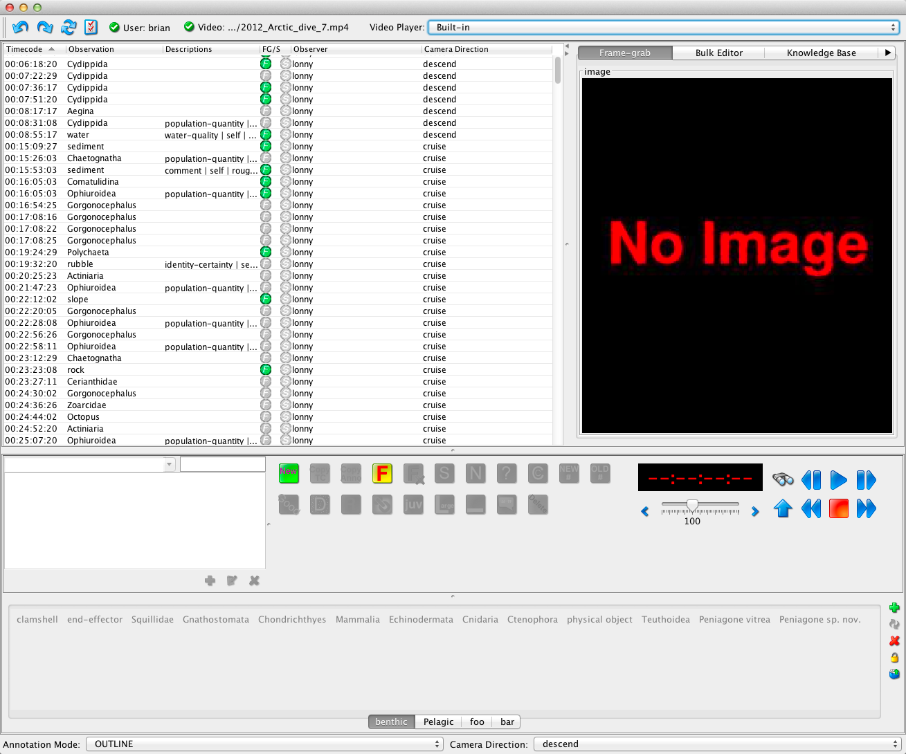

    

The Annotation application allows researchers on the ships to make annotations of objects and events observed in the video, as it is being recorded by the ROV cameras. However, it is rarely possible to get all the details recorded in real-time. The view through the camera is constantly changing, and a variety of creatures (and other objects) appear and disappear with great frequency. Every tape is later viewed in the video lab, and the rest of the details are added to the annotation database by video lab personel.

The instructions and documentation on these pages are presented for those who might be using the interface on a cruise or doing research in the MBARI video lab.

- [User Guide](annotation_userguide.html)