This guide provides basic instructions for starting and using the VARS Annotation application. Useful definitions can be found in the [glossary](glossary.html)

## Set-up and Getting Started

- If you are working with __video tapes__, please read the instructions in this [README](https://github.com/hohonuuli/vars/tree/master/vars-standalone/src/main/assembly/files) file.
- If you are annotating __video files__, follow the setup instruction in this [README](https://github.com/hohonuuli/vars/tree/videofile-jdk8/vars-standalone/src/main/assembly/files) file.

## Logging in 

- __Creating a user account__. To annotate in VARS you will need a VARS user account. If this is the very first time that VARS is being launched on a new database, you will need to create an admin account. Please see the [Knowledgebase User Guide](knowledgebase_userguide.html) for instruction on creating an admin account. If you just need to create a non-admin user account, do the following:
    1. Click on __User:__ on the toolbar.
    2. In the login dialog that appears, click on _Create a new user account_. 

    <a href="images/annotation_app2.png">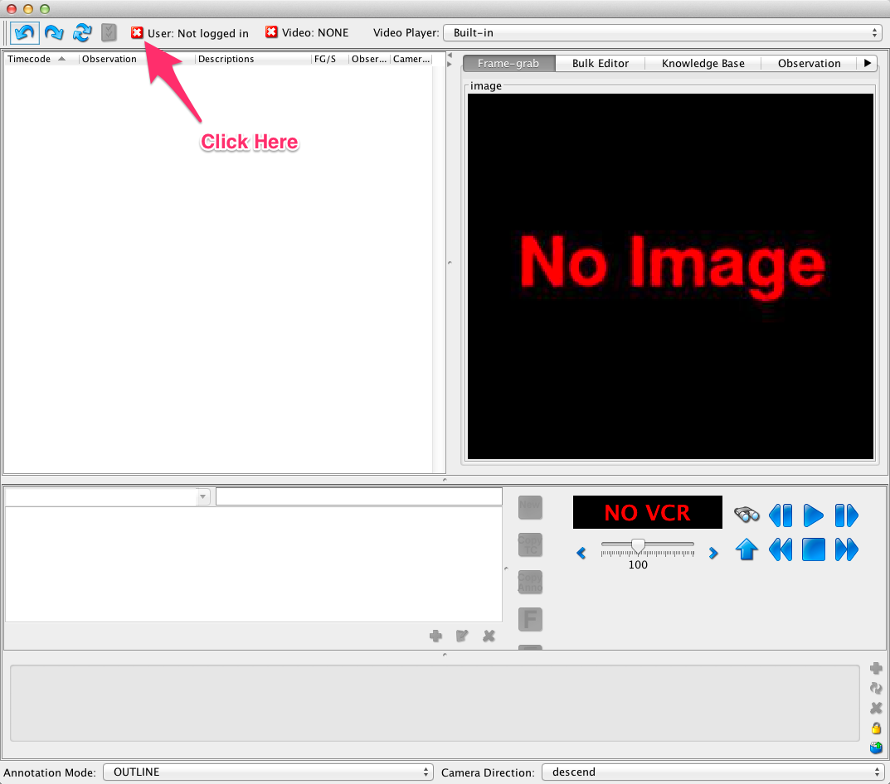</a>

    <a href="images/annotation_app_userlogin2.png">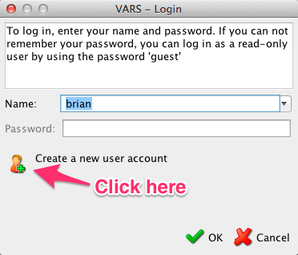</a>

- __Login to VARS__. If you already have a user account you can simply log in to VARS.
    1. Click on __User:__ on the toolbar
    2. In the login dialog that appears select or type your user name and click the __OK__ button

## Opening a Video

- __Open a movie file__.  
    1. Click on the __Video:__ on the toolbar
    2. In the movie dialog that appears, you can choose to browse to a new movie or open one that had previously been annotated.
        - To browse to a new movie, select the _Open by Location_ check box. Then browse to or enter a URL to a movie. You __must__ also select a _camera platform_ and enter a _sequence number_.
        - To open a previously annotated move, select the _Open Existing_ checkbox. Then select the name of the file you'd like to annotated.

    <a href="images/annotation_app3.png">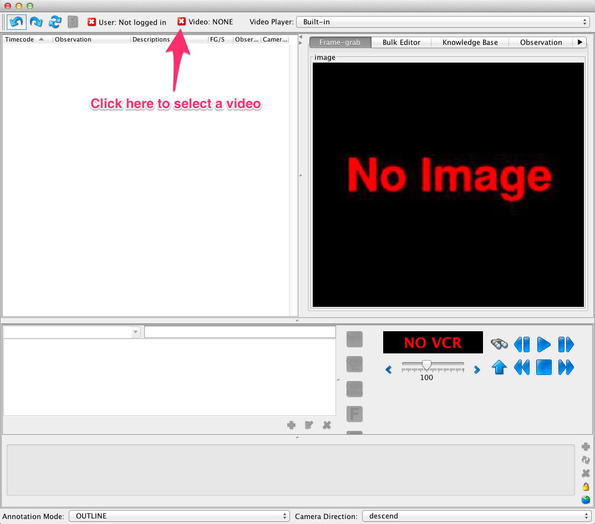</a>

    <a href="images/annotation_app_moviedialog.png">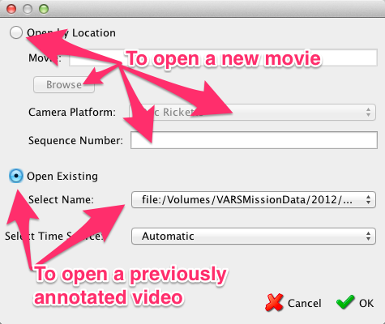</a>

## Video Controls
The interface includes a VCR control panel. This panel was designed for use with VCR's but works _mostly_ as expected with video files.  

    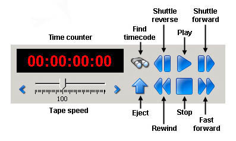

## Adding and Modifying Annotations

__NOTE__ we use the terms __observation__ and __annotation__ interchangable in the documentation below. 

### Adding an Annotation

1. Click on the __New__ button (or ctrl+n / cmd+n). A new line will be created in the observation table with the default object in the observation column and with the current VCR timecode.
2. Type the concept name in the editor and press __Enter__. The new concept name will be updated in the observation table.
3. For faster annotations see information below about a __custom icon panel__.

    <a href="images/annotation_app4.png">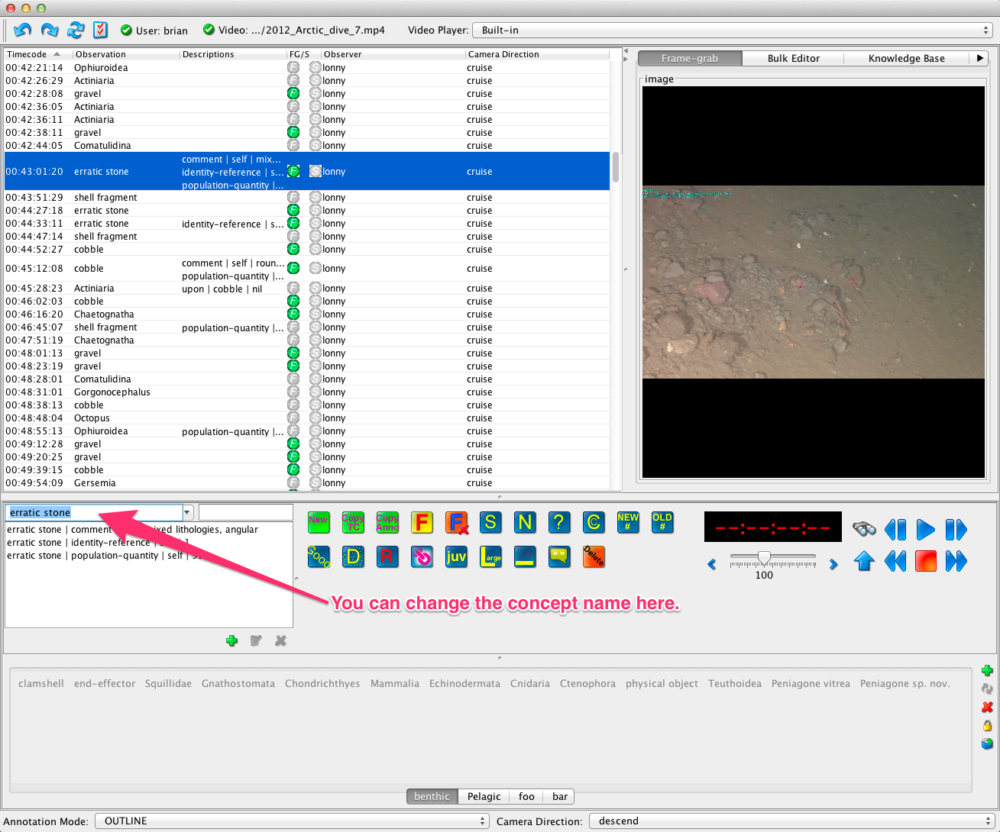</a>

### Adding an Annotation with a Frame Grab

1. To create an annotation associated with a frame grab, click the frame grab (__F__) button (or ctrl+f / cmd+f ).
2. The framegrab will be displayed in the upper right corner of the user interface, under the __Frame-grab__ tab. By default, the concept physical-object will be entered in the observation column. The __F__ button in the __FG/S__ column of the observation table will be highlighted in green, indicating there is a frame grab associated with this observation.
3. To give the annotation a more specific name (concept), type the concept in the concept editor (located just under the observation table), and press __Enter__.

    <a href="images/annotation_app5.png">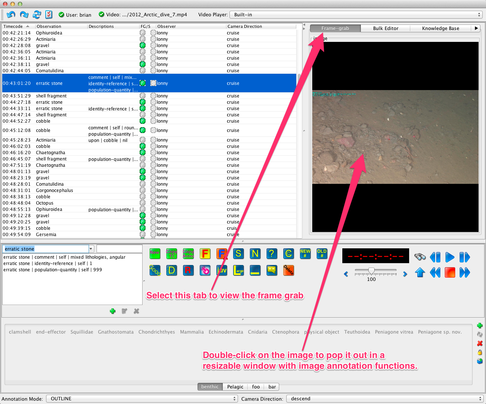</a>

### Adding an Association to an Observation

An _association_ is a structured descriptor that provides additional information about an annotation. For example, color of the item, behavior such as swimming or eating, resting on some substrate, etc.

1. Select a row in the annotation table.
2. In the concept editor click on the green __+__ button.
3. In the association search box, type part of the association you wish to search for and press enter. 
4. You can continue to press enter to scroll through additional matches.
5. Press the green __+__ button again to add the association. The association editor will automatically close.

    

    <a href="images/annotation_app7.png">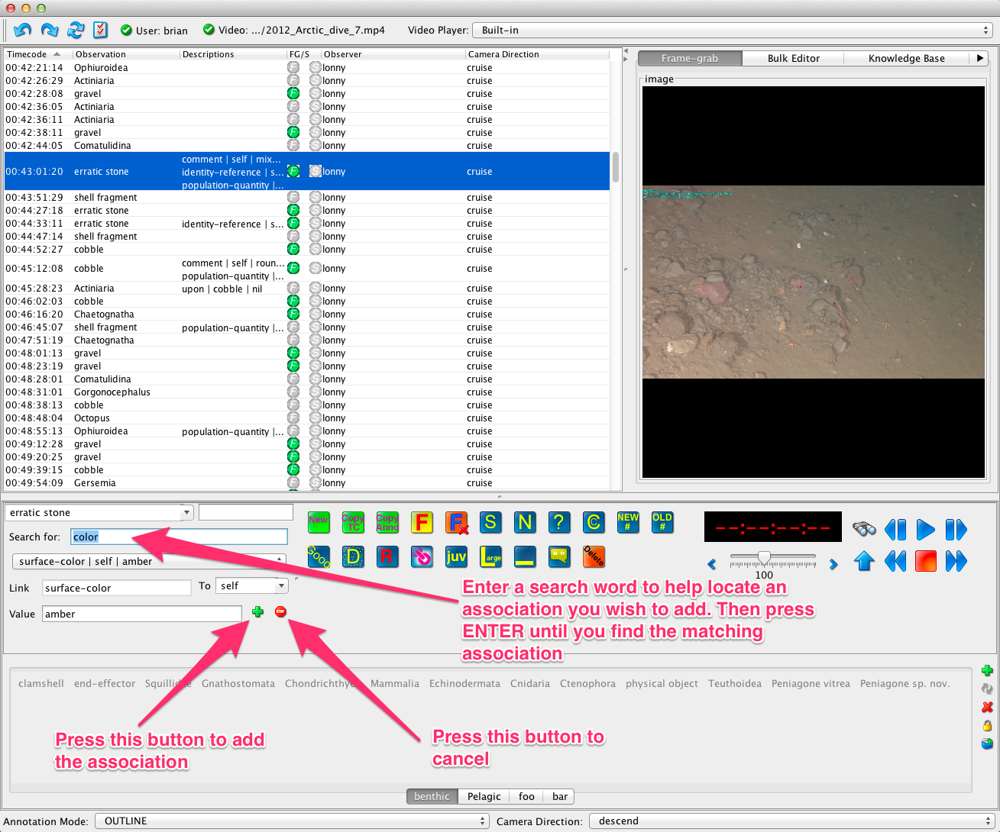</a>

An alternative method of adding an association is to use the blue 'quick annotation' buttons.

    <a href="images/annotation_app8.png">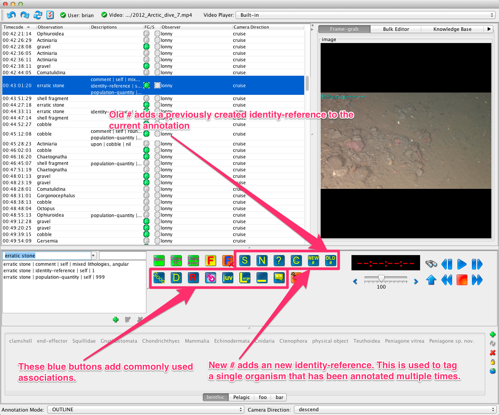</a>

### Deleting an Observation

1. Select an observation to be deleted.
2. Click the __Delete__ button (or use ctrl-delete / cmd-delete)

__NOTE__: VARS has undo / redo buttons on the toolbar in case you delete observations you meant to keep. You can undo the last 25 operations in VARS.

### Deleting an Association from an Observation

1. Highlight the observation row to be edited, so that the associations for that observation will appear in the concept editor.
2. In the editor, highlight the association to be deleted.
3. Click the red __X__ (Remove Association) button and the association will disappear from the concept editor or the observation table.

    <a href="images/annotation_app9.png">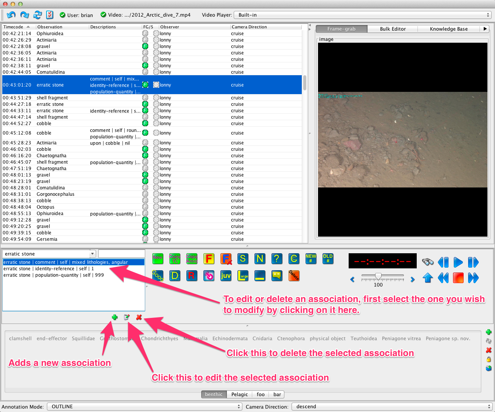</a>

## Custom Icon Tabs

If you do a lot of annotations, setting up a custom icon tab (in the panel area across the bottom of the interface) allows adding new observations quickly. For this panel, each _icon_ is really a word—specifically the name of a concept. For efficient annotation, you can create separate tabs for different types of dives, such as Geology or Midwater, and populate each with the names of commonly observed objects in those categories.

### Creating Custom Icon Tabs

1. To create an icon tab, click on the __New__ button at the right of the icon panel.
2. At the prompt, name the new tab.
3. Click on the __Knowledge Base__ tab in the upper right hand corner of the interface. 
4. In the search box, type the name of the object that you would like to add to the tab. (The first name in the hierarchy with those letters will be highlighted.) 
5. Press __Enter__ until the correct object is highlighted.
6. Click on the name, and drag it onto the tab that you created. The name is now an icon.
7. Continue adding icons as needed.
8. Organize the icons by dragging them around within the tabs.
9. To delete a icon (concept) from a tab, right-click on the icon, and select __Delete__ from the drop-down menu.
10. To locate a concept in an icon tab within the knowledge base tree (for reference), right-click on the icon in the panel, and select __Find in knowledgebase__ tree from the drop-down menu. The concept will be highlighted in its correct position in the knowledge base.

    <a href="images/annotation_app10.png">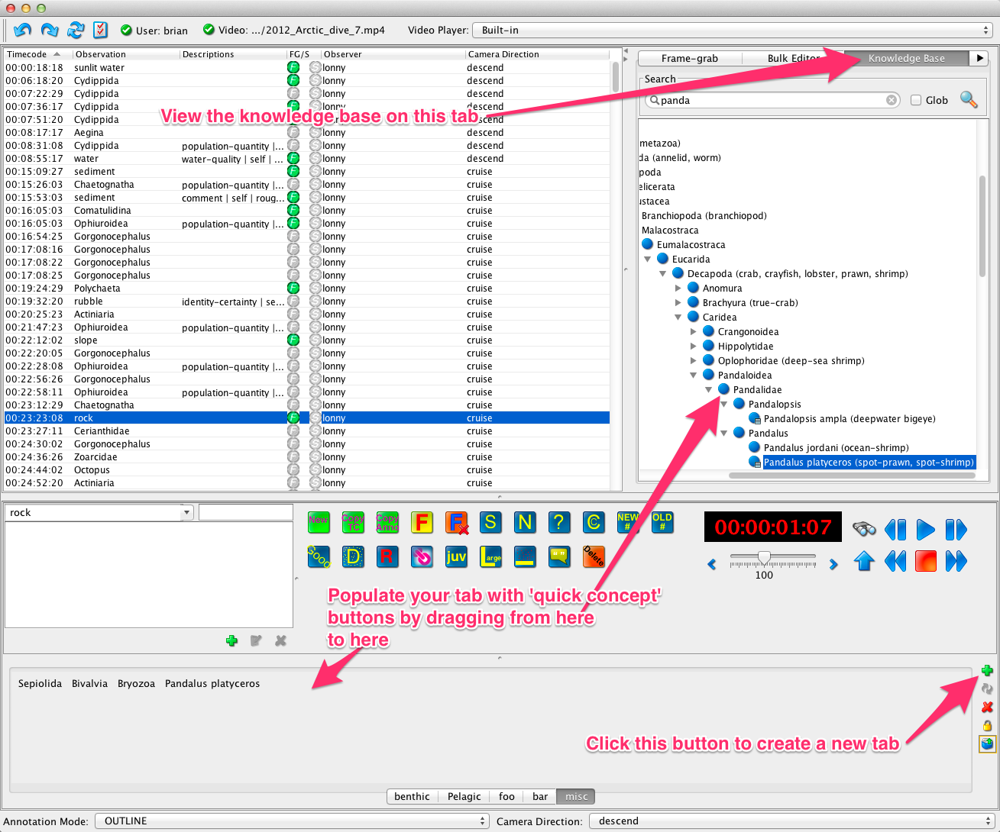</a>

### Adding Observations using Icons

1.  Click on the icon with the name of the concept to be added. The observation will be added to the table along with the current VCR time code.

## Contacts

For addition help with the VARS annotation interface please use the [MBARI-VARS Google Group](https://groups.google.com/forum/#!forum/mbari-vars), or email mbari-vars at googlegroups dot com. 

For help with technical details or issues, contact [Brian Schlining](http://www.mbari.org/staff/brian/)

