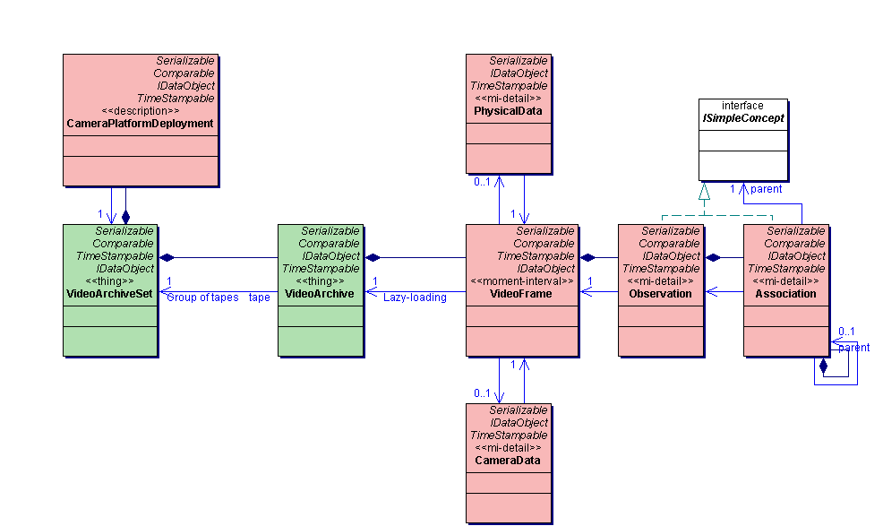
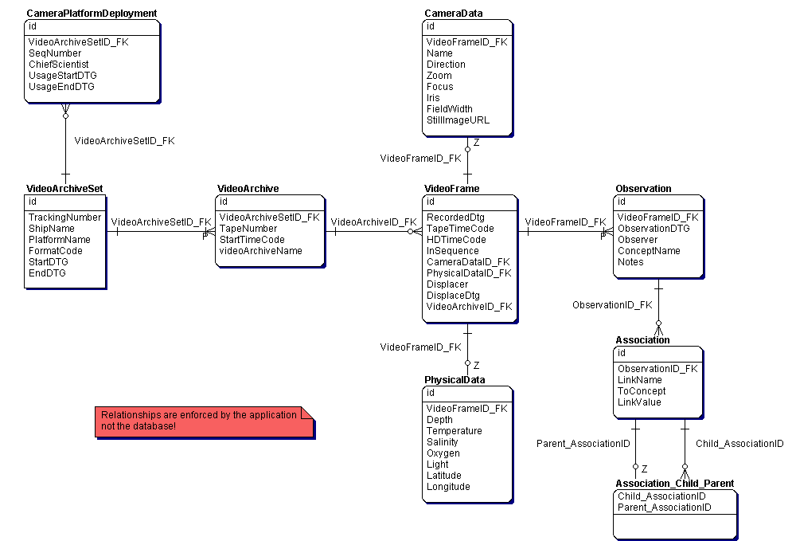
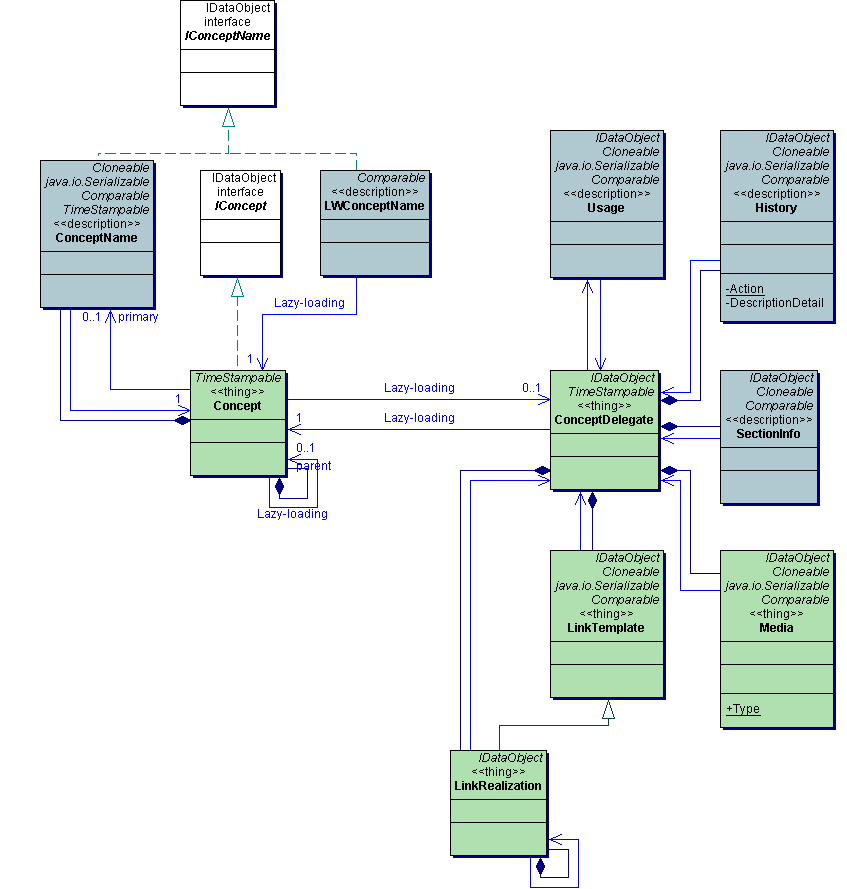
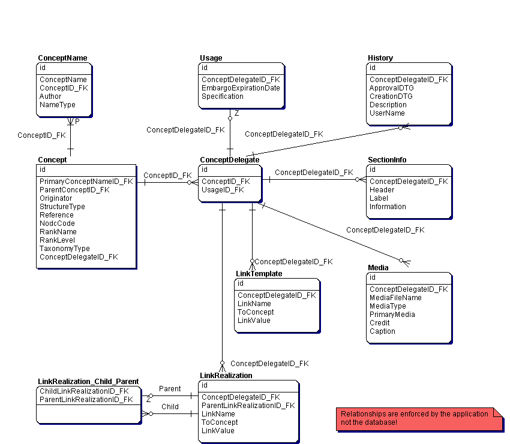

# Database Schema

The VARS data model consists of 2 distinct models, the annotation model and the knowledgebase model. These are represented in the Java applications as UML diagrams and in the Database as ER diagrams. The mapping between Java classes and the database tables is straightforward. A Java object typically represents a row in the database table of the same name (i.e. an Observation object is stored in the Observation table). 

The annotaiton and knowldegebase databases can be hosted in different databases or even on different servers. At MBARI, we have several different annotation databases for different purposes. However, we only a single knowledgebase database that is shared by all other VARS applications.

## Annotation Schema

### UML Diagram

    

### ER Diagram

    

## Knowledgebase Schema

    

### ER Diagram

    

