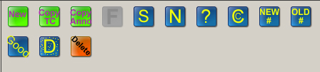
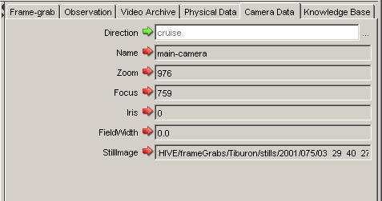

## Definitions and Descriptions
__?__ - An annotation buttion used to indicate the identity of some object is uncertain.

__Annotation Mode__  - Select the annotation mode: _Outline_ or _Detail_. This can be selected on the bottom left of the main annotation window.

- _Outline_ annotations include animals discernable at approximately 2x real-time tape speed. The level (species, genus, family, etc.) and certainty of identification depends on current knowledge of deep-sea organisms and physical factors, such as ROV speed, camera setting, or visibility. Outline annotation also includes characterization of major habitats, such as seep or canyon wall, and geological features such as rock outcrop, sand, or fault. The characterization is usually annotated at a regular intervals (approximately five minutes), at identification of samples and equipment, and at the start and end of transects.  
- _Detailed_ annotations include all discernable organisms, behaviors, and habitats possible at real-time speed.

__association__ - Descriptor(s) for physical object in observation. The descriptor must match an association entered in the knowledge base, or it will not be recognized by VARS.

__buttons__ - The buttons in the middle of the interface have various purposes. Some are action buttons (green or red) and some are annotation buttons (blue). 

__C__ - Button that adds an association indicating a close-up view.

__Camera Data tab__ - Shows details of the camera settings for the selected entry. 

- __Direction__ - Indicates the direction that the ROV is moving (ascend, cruise, descent, endtransect, launch, starttransect, stationary, transect). Default value when starting a new video set is descend. The direction in an existing entry can be edited by clicking on the Edit button.
- __Name__ -Displays the name of the camera that recorded the observation. Almost all annotations are associated with main camera. Other available names are aux-camera, bioluminescent-camera, color-bars, main camera, sit-camera, and still-photo-camera.
- __Zoom__ - Displays the current value which, for this purpose, indicates the relative distance from an object. At MBARI, the units are in millimeters (mm) and values generally range from -200 to 1000.
- __Focus__ - Indicates the distance in millimeters (mm) from the center of the lens to the focal point. The general range is from -511 to 1000 mm.
- __Iris__ -Displays the setting for the aperture (iris), which controls the light and depth of field. This setting indicates the amount of light allowed to enter the camera lens for recording. Settings range from 0 to 4095.
- __FieldWidth__ - The width of the field visible in the frame. This varies with the Zoom value.
- __StillImage__ - Displays the URL of the frame grab (image).

__concept__ - Name of physical object in observation. Must match a concept entered in the knowledge base or will not be recognized by VARS.

__Copy Anno__ - Short for _copy annotation_. A button that creates a new observation row with the same concept (and associations) as the highlighte row but at the current video time code.

__Copy TC__ - Short for _copy timecode_. A button that creates a new row in the observation table with the same time code and concept as the highlighted row. You can then change the concept. Useful for situations with more than one object in a frame (grab).

__D__ - A button that adds an association indicating a _dense population_.

__Delete__ - Abutton that deletes one or more rows of observations.

__F__ - A button that grabs an image from the video and creates a new observation for it.

__Frame-grab tab__ - Displays a frame grab of the selected observation, if it is available.

__Good__ - a button that adds an association indicating that the image quality is good.

__green checkmarks__ - Seen on the toolbar in the [VARS Annotation App](annotation.html). Green checkmarks indicate that the selected setting is valid.

__keyboard shortcuts__ - The following shortcuts may be used, instead of clicking buttons, to create new or multiple annotations. (Using keyboard shortcuts reduces the risk of repetitive strain injury from excessive mouse clicking.)
<table>
    <caption>Shortcuts</caption>
    <thead>
        <tr>
            <th>Shortcut</th>
            <th>Windows</th>
            <th>Mac OS X</th>
        </tr>
    </thead>
    <tbody>
        <tr>
            <td>Create a new observation</td>
            <td>ctrl+N</td>
            <td>cmd+N</td>
        </tr>
        <tr>
            <td>Copy timecode</td>
            <td>ctrl+D</td>
            <td>cmd+D</td>
        </tr>
        <tr>
            <td>Capture a framegrab</td>
            <td>ctrl+F</td>
            <td>cmd+F</td>
        </tr>
        <tr>
            <td>Delete selected observations</td>
            <td>ctrl+delete</td>
            <td>cmd+delete</td>
        </tr>
        <tr>
            <td>Scroll up one row</td>
            <td>ctrl+up_arrow</td>
            <td>cmd+up_arrow</td>
        </tr>
        <tr>
            <td>Scroll down one row</td>
            <td>ctrl+down_arrow</td>
            <td>cmd+down_arrow</td>
        </tr>
    </tbody>
</table>
