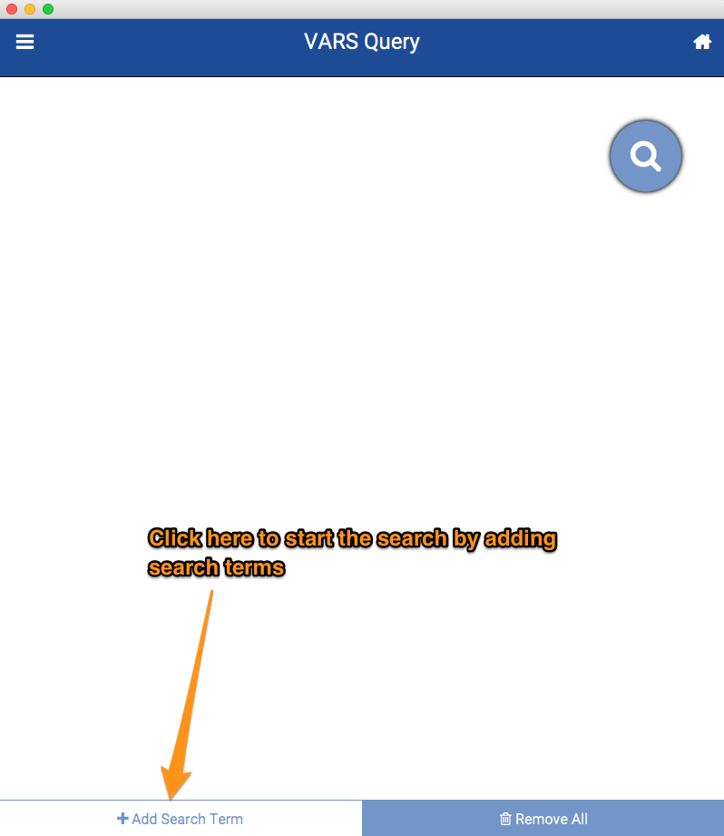
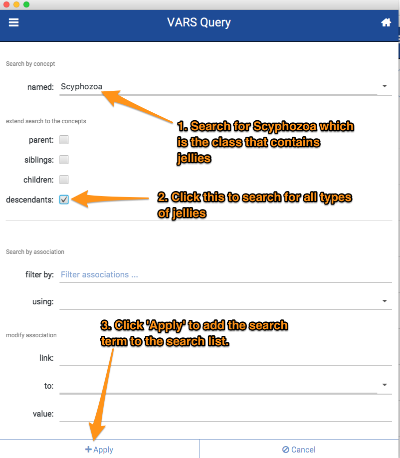
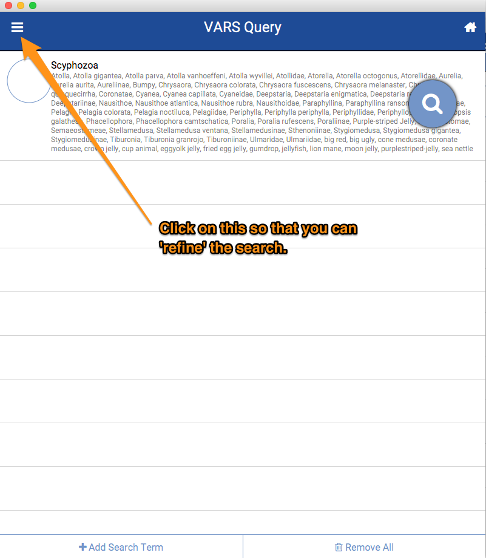
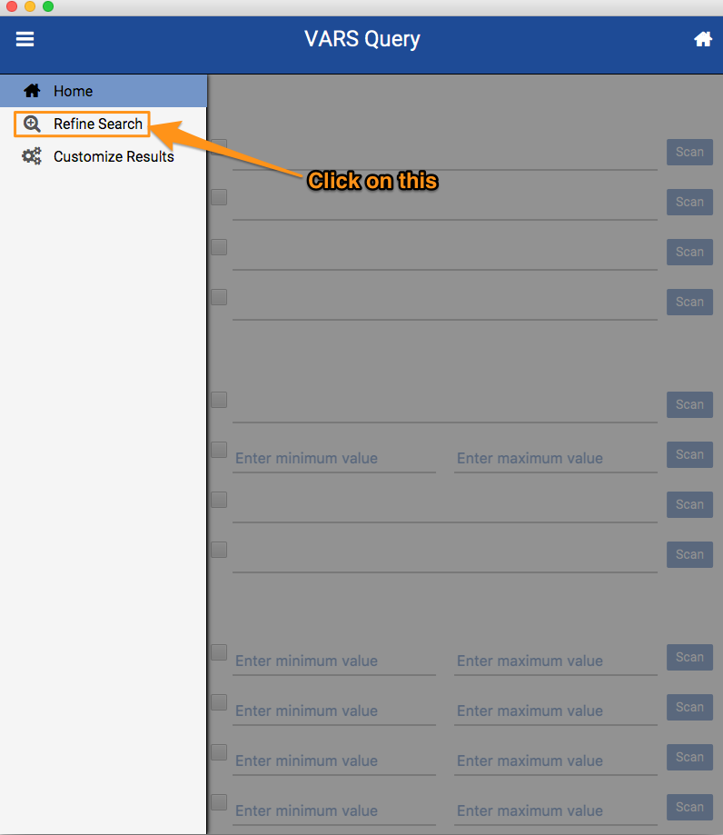
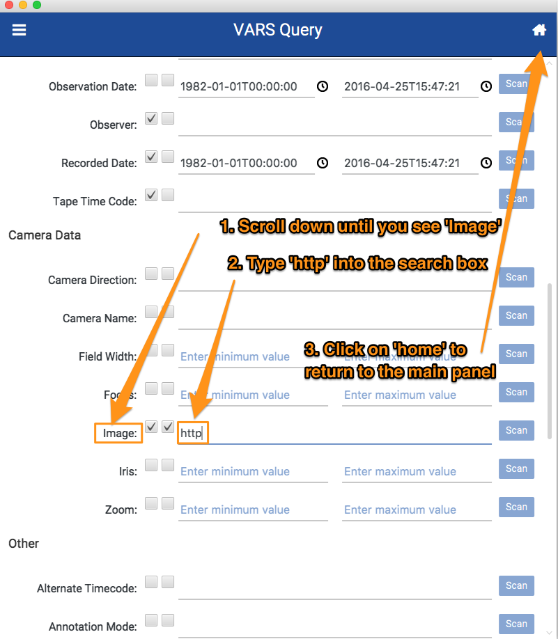
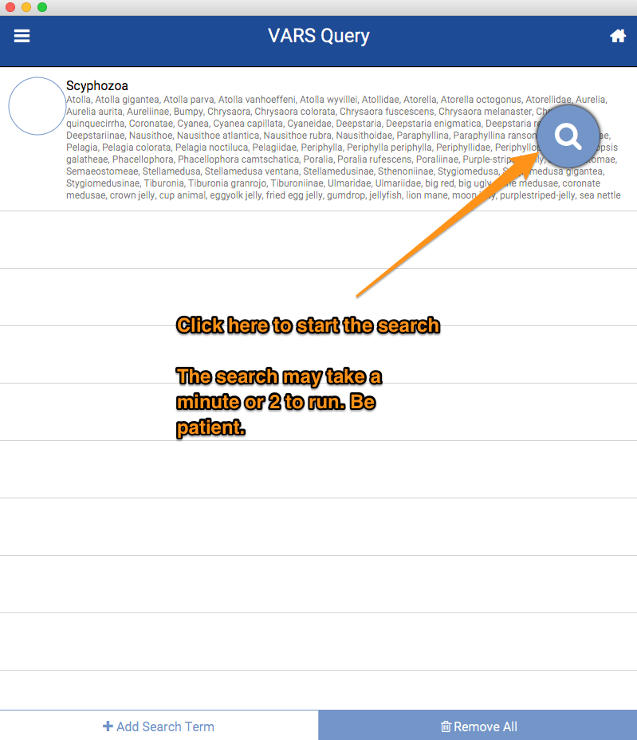
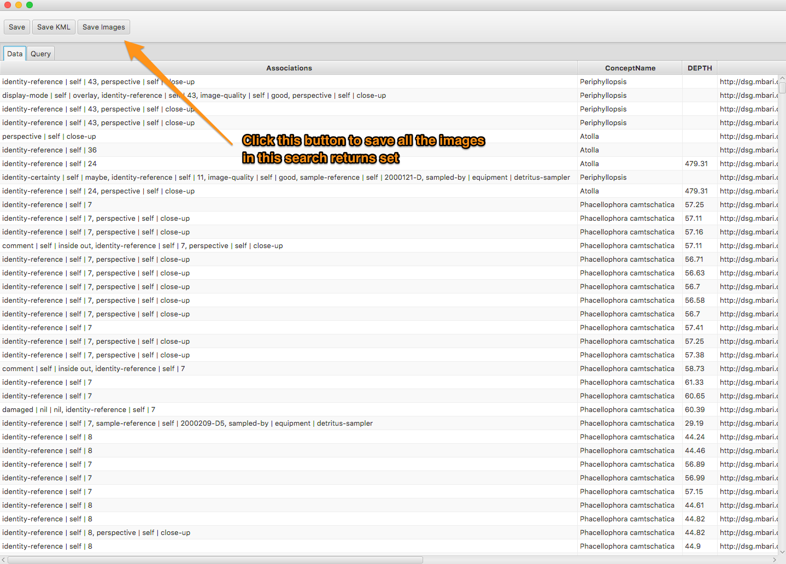

## Example #1

In this example, we will use the [VARS QueryFX application](http://dsg.mbari.org/vars/webstart/varspublicqueryfx.jnlp) to find all publicly available video annotations with images of [jellies](http://dsg.mbari.org/dsg/view/concept/Scyphozoa) that are available in MBARI's VARS dataset.

### Step #1 - Launch the QueryFX App

__Prerequisites__: You will need to have [Java 8+](http://www.oracle.com/technetwork/java/javase/downloads/index.html) installed.

VARS QueryFX is launched using Java Web Start. Simply use this link to start it: [http://dsg.mbari.org/vars/webstart/varspublicqueryfx.jnlp](http://dsg.mbari.org/vars/webstart/varspublicqueryfx.jnlp)

### Step #2 - Adding a Search Term

We want to search for __all__ types of Schypozoans (e.g. jellies). In order to do that we tell the app to search for __Schyphozoa and all of it's phylogenetic descendants__.

    

    

### Step #3 - Narrow the Search to Annotations with Images

Now that we've defined the terms we want to search for, we want to add a constraint to the search to only include annotations with images.

    

    

    

### Step #4 - Run the Search

Just click on the great big search button in the app to start the search. Remember that you are searching through millions of records so some searches, like this one, may take a minute or two or three to run. I know that's several life-times in internet minutes. Just Be Patient. 

    

### Step #5 - Save the Images from the Search

A window with the search results will pop up when completed. You can save __all__ of the images in the search just by clicking on the _Save Images_ button on the toolbar.

    

