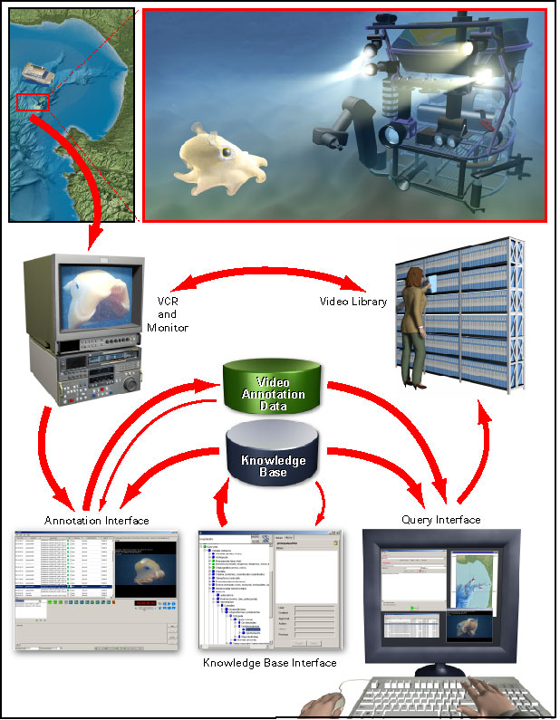

The Video Annotation and Reference System (VARS), consisting of software and hardware, was developed to facilitate the creation, storage, and retrieval of video annotation records from the ROV dive tapes.

As shown in the figure below, video is initially recorded by cameras. At MBARI, we collect video using ROVs (remotely operated vehicles). This video can then be archived on tape or in video files. Using the Annotation application, users can take frame grabs and enter annotations of interesting events and observations seen on the video. Annotations are constrained by terms and description templates stored in a knowledge database. If needed, users can edit the contents of the knowledge database using the Knowledgebase application. At any point, users can search for and retrieve annotations through the Query application.

    

## VARS Knowledgebase

The core of the system is a extensible knowledge database of biological, geological and technical terms used to describe deep-sea research conducted by the institute. This database is comprised of objects, which are identifiable things—for example, Atolla wyvillei jelly, fault, myctophid fish, gas vent, or suction sampler. The knowledge base also contains associations, which serve as descriptors (such as blue, large, juvenile, or active) that can be associated with the objects being analyzed. The taxonomic data can be viewed in alphabetic or hierarchical order and is accompanied by descriptive information that serves as a marine reference guide for system users. The hierarchical information allows for consistent, rapid classification and description and complex querying of objects observed on video.

The Knowledgebase application allows science personnel to easily add, view, and edit information contained in the knowledgebase. To ensure consistency, all amendments must be authorized by a knowledge base manager. Functioning as an encyclopedia, the knowledgebase is used with the annotation application to characterize video observations in a consistent fashion. At MBARI we have over 5,000 terms in our database; the VARS download contains a subset of our knowledgebase. You can easily customize the terms in the knowledgebase to suit your research.

[Documentation and instruction for VARS Knowledgebase Application](knowledgebase.html)

## VARS Annotation

The Annotation application allows researchers on the ships to make annotations of objects and events observed in the video, as it is being recorded by the ROV cameras. However, it is rarely possible to get all the details recorded in real-time. The view through the camera is constantly changing, and a variety of creatures (and other objects) appear and disappear with great frequency. Every tape is later viewed in the video lab, and the rest of the details are added to the annotation database by video lab personel.

The instructions and documentation on these pages are presented for those who might be using the interface on a cruise or doing research in the MBARI video lab.

[Documentation and instruction for VARS Annotation Application](annotation.html)

## VARS Query

The VARS Query allows easy access to information from a video annotation database. Complex queries can be made by constraining temporal, spatial, or physical parameters (for example: season, location, or depth). The VARS Query references the knowledgebase (described above). Using the query tool, users can identify the location of video sequences or access other information recorded during ROV research dives.

[Documentation and instruction for VARS Query Application](query.html)
